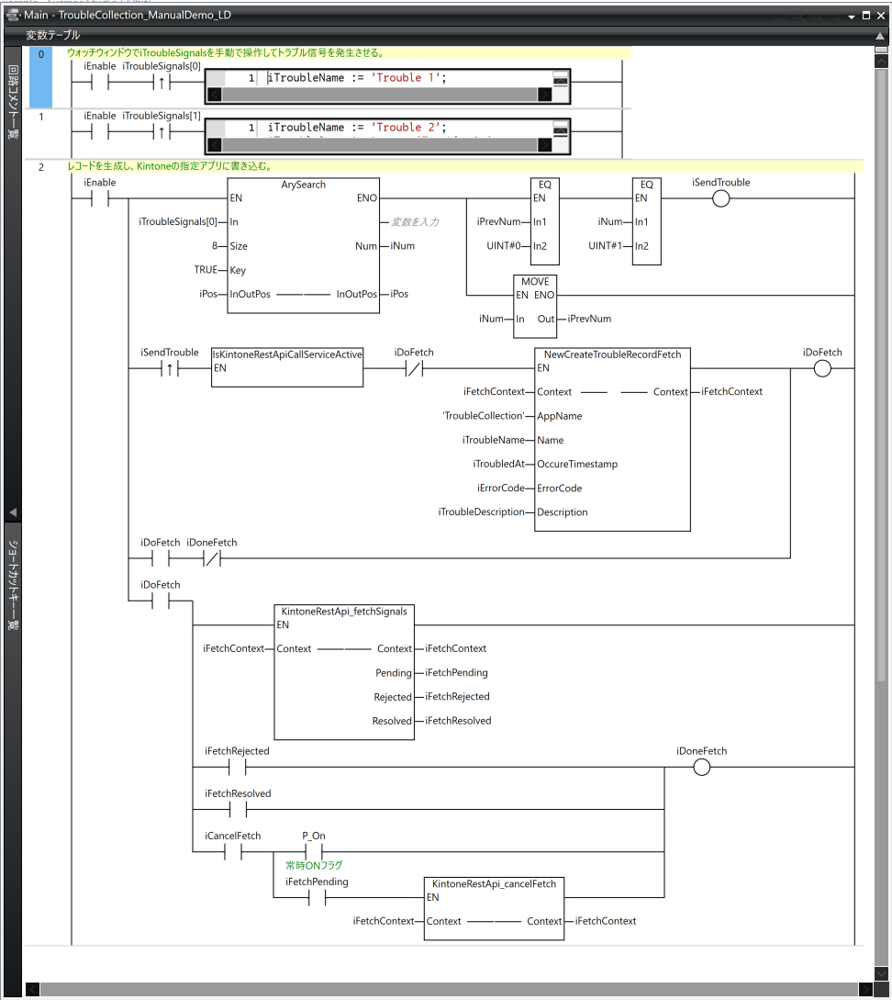
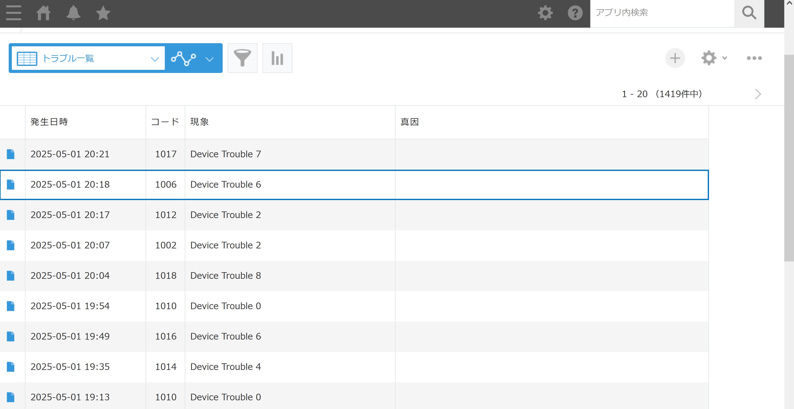
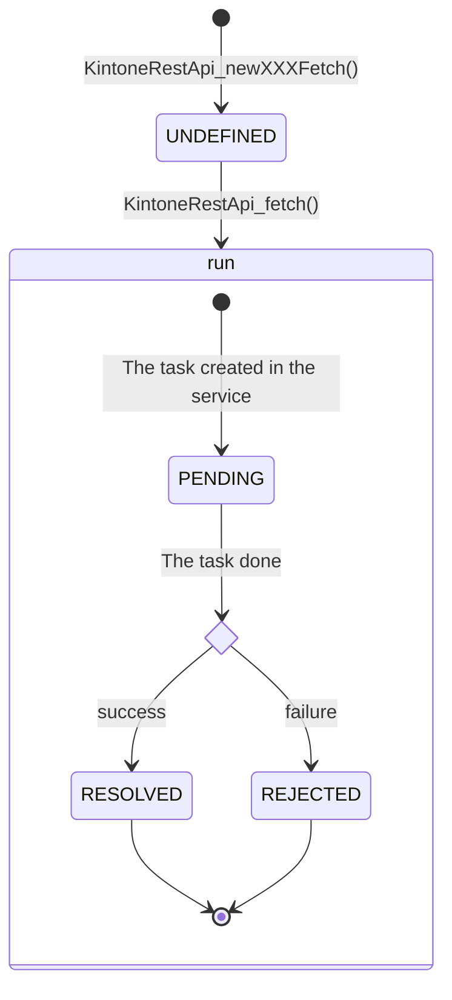

# kintone REST API client for NX
これは、OMRON社のNXコントローラ向けのkintone REST API client(APIクライアントサービス)ライブラリです。
[kintone](https://kintone.cybozu.co.jp/)はサイボウズ株式会社が提供するノーコード・ローコードツールです。
このライブラリは、簡潔なkintone REST API呼び出し機能を提供します。
第三者向けのプロダクトレベルの品質ではありませんが、内部的な使用は可能です。
詳細は、["NXとkintoneをつなぐ"](https://zenn.dev/kitam/articles/81f9b1482f9056)を確認してください。

ライブラリは、外部からのAPIクライアントサービス制御を目的とするOPC UAノード(制御ノード)を公開するファンクションブロック(FB)を含みます。
FBをOPC UAサーバで公開することで、OPC UAクライアントを使用してAPIクライアントサービスを制御できます。
制御ノードは、APIクライアントサービスの有効/無効化とアプリケーション設定機能を有しています。
これらにより、プロジェクト及びコントローラにkintoneに関連するシークレット情報を保持しない構成や、運転中のホットリロードが可能になります。
制御ノード操作は、コントローラとOPC UAサーバのアクセスコントロールにより保護されます。
OPC UAによる外部制御は、`control/`ディレクトリを確認してください。

ユーザーはkintone REST APIを、以下のようなコードで呼び出します。
fetch、resolved、rejectedという単語で予想がつくと思います。

```iecst
100:
    NewCreateTroubleRecordFetch(
        Context:=iFetchContext,
        AppName:=KINTONE_APP_NAME,
        Name:=iTroubleName,
        OccureTimestamp:=iTroubledAt,
        ErrorCode:=iErrorCode,
        Description:=iTroubleDescription);
    
    Inc(iState);
101:
    CASE KintoneRestApi_fetch(iFetchContext) OF
        ATS_RESOLVED: // 成功
            iState := iReturnState;
        ATS_REJECTED: // 失敗
            KintoneRestApiFetch_getError(
                Context:=iFetchContext,
                Error=>iError,
                ErrorID=>iErrorID,
                ErrorIDEx=>iErrorIDEx);
            
            iState := iReturnState;
    END_CASE;
```

NewCreateTroubleRecordFetchは、以下のコードです。
GenerateTroubleRecordでkintoneアプリに追加するレコードを生成し、KintoneRestApi_newCreateRecordFetchでFetchというAPI呼び出し単位を生成します。
使用にはFetchの詳細は不要で、KintoneRestApi_newCreateRecordFetchが1件のレコードを登録するkintone REST APIに対応することが分かれば十分です。

```iecst
NewCreateTroubleRecordFetch := FALSE;
IF NOT EN THEN
    RETURN;
END_IF;

IF NOT GenerateTroubleRecord(
           Record:=iRecord,
           Head:=0,
           Size=>iRecordSize,
           Name:=Name,
           OccureTimestamp:=OccureTimestamp,
           ErrorCode:=ErrorCode,
           Description:=Description)
THEN
    RETURN;
END_IF;
NewCreateTroubleRecordFetch
    := KintoneRestApi_newCreateRecordFetch(
           Context:=Context,
           AppName:=AppName,
           Record:=iRecord,
           RecordHead:=0,
           RecordSize:=iRecordSize);
```

LDは以下のようになります。



上記のコードはいずれもAPI呼び出し要求を行うだけです。
別途、API呼び出し処理を行うPOUをあらかじめ実行しておく必要があります。
以下のようなAPI呼び出し処理を行うPOUを含むプログラムを実行します。
POUにシークレット情報を配置するのであれば、別途パスワード保護をします。

```iecst
CASE iState OF
    // STATE_INIT
    0:
        // 単独動作モード: TRUE=OPC UAによる制御を行わない, FALSE=行う
        IsStandaloneMode := FALSE;
    
        // サービスを構成
        ConfigureKintoneRestApiClientService(
            LockKey:=17);
        iService.Enable := TRUE;
        
        IF IsStandaloneMode THEN
            iState := STATE_SETTING;
        ELSE
            iState := STATE_ACTIVE;
        END_IF;

    // STATE_SETTING
    5:
        // サービス構成
        ConfigureKintoneRestApiClientService(
            // 排他制御キー。
            LockKey:=17);
        
        // 設定初期化
        InitKintoneRestApiClientServiceSettings();
        
        // Kintoneアプリの登録
        // トラブル収集アプリの登録
        RegisterKintoneApp(
            Name:='TroubleCollection',
            Subdomain:='YOUR_KINTONE_SUBDOMAIN',
            AppId:='YOUR_APP_ID',
            ApiToken:='YOUR_APP_API_TOKEN');
                
        // 無制約TLSセッションの登録
        RegisterUnrestrictedTlsSession(
            TlsSessionName:='TLSSession0');
        RegisterUnrestrictedTlsSession(
            TlsSessionName:='TLSSession1');

        Inc(iState);
    6:
        IF iCtrlReload THEN
            ReloadKintoneRestApiClientService();
            iCtrlReload := FALSE;
        ELSE
            EnableKintoneRestApiClientService();
            iService.Enable := TRUE;
        END_IF;

        iState := STATE_ACTIVE;
    
    // STATE_ACTIVE
    10:
        // オンラインによる手動操作用
        IF iCtrlEnable THEN
            EnableKintoneRestApiClientService();
            iCtrlEnable := FALSE;
        ELSIF iCtrlDisable THEN
            DisableKintoneRestApiClientService();
            iCtrlDisable := FALSE;
        ELSIF iCtrlReload THEN
            IF IsStandaloneMode THEN
                iState := STATE_SETTING;
            ELSE
                ReloadKintoneRestApiClientService();
                iCtrlReload := FALSE;
            END_IF;
        END_IF;
END_CASE;

iService();
```

サンプルプロジェクトを編集してコントローラで実行すると、kintoneアプリに以下のようにレコードを作成します。
これはトラブル収集アプリで、トラブルが発生した時点でkintoneにレコードを作成します。



APIクライアントサービスには、以下の制約があります。

* HTTPプロキシ環境では使用できない

APIクライアントサービスは、以下のkintone REST APIに対応しています。

* [1件のレコードを登録する](https://cybozu.dev/ja/kintone/docs/rest-api/records/add-record/)
* [1件のレコードを取得する](https://cybozu.dev/ja/kintone/docs/rest-api/records/get-record/)
* [1件のレコードを更新する](https://cybozu.dev/ja/kintone/docs/rest-api/records/add-record/)
* [複数のレコードを登録する](https://cybozu.dev/ja/kintone/docs/rest-api/records/add-records/)
* [複数のレコードを取得する](https://cybozu.dev/ja/kintone/docs/rest-api/records/get-records/)
* [複数のレコードを更新する](https://cybozu.dev/ja/kintone/docs/rest-api/records/add-records/)

# 使用環境
このプロジェクトの使用には、以下の環境が必要です。

|Item|Requirement|
|-|-|
|コントローラ|NX1またはNX5|
|Sysmac Studio|最新版を推奨。|
|ネットワーク|インターネット接続が可能であること。|
<!--
# Usage environment
The following environment is required to use this project

|||
|-|-|
|Controller|NX1 or NX5|
|Sysmac Studio|I always recommend the latest version.|
|Network|Must be able to connect to the Internet.|
-->

# 構築した環境
このプロジェクトは、以下の環境で構築しました。

|Item|Version|
|-|-|
|コントローラ|NX102-9000 Ver 1.64|
|Sysmac Studio|Ver.1.63|
<!--
# Built environment
This project was built in the following environment.

|||
|-|-|
|Controller|NX102-9000 Ver 1.64|
|Sysmac Studio|Ver.1.62|
-->

# サンプルプロジェクトの使用手順
サンプルプロジェクトの実行には、kintone、サンプルプロジェクト、コントローラのそれぞれについて作業が必要です。
kintoneはスタンダードコース以上か、開発者ライセンスでの使用が前提です。
いずれも無い場合、[kintone開発者ライセンス](https://cybozu.dev/ja/kintone/developer-license/)を取得します。

### 1. kintoneアプリを作成
リポジトリにアプリテンプレートがあるので、それを使用してアプリを作成します。
テンプレートからのアプリ作成は、以下を参考にします。

* [テンプレートファイルからアプリを作成する](https://jp.cybozu.help/k/ja/app/setup/app_csv/add_app_template_file.html)

テンプレートファイルは、example-app-templates.zipを使用します。

### 2. kintoneアプリのAPIトークンを生成
アプリごとにAPIトークンを生成します。APIトークンの生成については、以下を参考にします。

* [APIトークンを生成する](https://jp.cybozu.help/k/ja/app/api/api_token.html)

各アプリが必要とするアクセス権限は以下です。

|アプリ|アクセス権限|
|-|-|
|トラブル収集|レコード追加|
|生産モニタ|レコード追加|
|生産タスク|レコード閲覧, レコード編集|
<!-- *デモアプリのAPIアクセス権限* -->

APIトークンを生成したら、アプリIDと合わせて控えておきます。
アプリIDは、APIトークン生成ページであれば、ページのURLに以下のように含まれています。

```url
https://{サブドメイン}.cybozu.com/k/admin/app/apitoken?app={アプリID}
```

### 3. サンプルプロジェクトを使用環境に合わせる
サンプルプロジェクトを使用環境に合わせて変更します。以下の変更が必要です。

* コントローラの型式   
   使用するコントローラの型式に変更します。
* コントローラのネットワーク設定  
   インターネットに接続可能な設定に変更します。DNSは特別な理由が無ければ、"1.1.1.1"のようなパブリックDNSを使用します。

### 4. サンプルプロジェクトのAPIクライアントサービスの設定を変更
**POU/プログラム/KintoneRestApiClientServiceRunner**を編集します。
まず、動作モードを指定します。
`IsStandaloneMode`を**FALSE**にしてOPC UAによる外部制御を行わないようにします。

```iecst
// 単独動作モード: TRUE=OPC UAによる制御を行わない, FALSE=行う
IsStandaloneMode := FALSE;
```

サンプルプロジェクトは、OPC UAサーバが動作しますが、OPC UAサーバのセットアップをしない限り制御ノード操作のアクセスが許可されることはありません。

次に、各RegisterKintoneAppの引数を作成したkintoneアプリに合わせます。
kintoneのサブドメイン、アプリID、APIトークンを変更します。
`YOUR_KINTONE_SUBDOMAIN`をログイン時に求められるサブドメインで、`YOUR_APP_ID`を2で控えたアプリID、`YOUR_APP_API_TOKEN`をAPIトークンで置き換えます。

```iecst
// トラブル収集アプリの登録
RegisterKintoneApp(
    // Nameは、プログラム内でアプリ情報を取得するキーとなる。
    Name:='TroubleCollection',
    // Subdomainは、kintoneで割り当てられたサブドメイン。
    Subdomain:='YOUR_KINTONE_SUBDOMAIN',
    // AppIdは、作成したアプリのID。
    AppId:='YOUR_APP_ID',
    // アプリで生成したAPIトークン。
    ApiToken:='YOUR_APP_API_TOKEN');
```

上記を使用するアプリ全てについて行います。
TLSセッションは、変更の理由が無ければ以下のままにします。

```iecst
RegisterUnrestrictedTlsSession(
    TlsSessionName:='TLSSession0');
RegisterUnrestrictedTlsSession(
    TlsSessionName:='TLSSession1');
```

### 5. コントローラのセキュアソケット設定にTLSセッションを登録
コントローラに接続、プログラムモードに変更してセキュアソケット設定に4で指定したNoと同じNoのセッションを登録します。
変更していなければ、IDが0と1のセッションを作成します。以下のように作業します。


### 6. コントローラにサンプルプロジェクトを転送
コントローラにサンプルプロジェクトを転送し、運転モードに切り替えます。ネットワークエラーが発生していないか確認します。ネットワークエラーが発生している場合、エラー原因を取り除きます。

エラーが発生した場合、以下の可能性があります。

* TLSセッションIDとTLSセッション名の不一致    
   4で指定したTLSセッション名の番号と5で指定したTLSセッションIDが一致していることを確認します。
* サブドメインの不一致   
   4で指定したサブドメインがkintoneのサブドメインに一致していることを確認します。
* APIトークンの不一致あるいは、アクセス権限の不足   
   4で指定したAPIトークンがkintoneで生成したAPIトークンに一致ていること、APIトークンのアクセス権限に不備がないことを確認します。
* インターネットに接続できないか、名前解決ができない   
   kintoneドメインまでのルートをtracertで確認します。
* kintoneで障害が発生している   
   [cybozu.com 稼働状況](https://status.cybozu.com/status/)を確認します。

# Sysmacプロジェクトについて
各Sysmacプロジェクト、ライブラリについては以下の通りです。

### KintoneRestApiClientServceLib.smc2
APIクライアントサービス開発用のSyamacプロジェクトです。
APIクライアントサービスの実装を確認することができます。

### KintoneRestApiClientServiceLib.slr
APIクライアントサービスのライブラリです。
APIクライアントサービスのライブラリは、依存ライブラリを含んでいません。
ライブラリを使用する場合、lib\の依存ライブラリも合わせて参照する必要があります。

#### 使用手順
既存プロジェクトでAPIクライアントサービスを使用する手順は以下です。
ライブラリ操作を伴うため、必ず既存プロジェクトのコピーを作成します。

1. **プロジェクトでAPIクライアントサービスのライブラリと依存ライブラリを参照**  
   リポジトリのlib/が依存ライブラリです。
2. **サービス用変数をグローバル変数に登録**   
   `gKintoneRestApiClientServiceSingleton : KintoneRestApiClientServiceSingletonContext`を定義します。
3. **サービスランナー(KintoneRestApiClientSingletonService FBを実行するプログラム)の作成**   
   サンプルプロジェクトを参考にしてください。
4. **サービスランナーをタスクに追加**   
   サービスランナーは、API呼び出し処理を実行するので、適切なタスク時間のタスクに登録します。
   プライマリタスクは不適です。
5. **ビルドしてエラーが無いことを確認**  
   ライブラリの不足やグローバル変数定義に誤りがあればエラーが出ます。
6. **メモリ使用状況を確認**   
   メモリ使用状況に変更が反映されているか確認します。

使用環境が整ったらAPIクライアントサービスを使用するプログラム、kintoneアプリを作成し、サービスランナーに必要な情報を記述します。大きなプロジェクトに対してこれらの操作を行うと時間がかかります。
可能であれば小さなプロジェクトで必要な機能を開発し、動作テストまで済ませてから必要とするプロジェクトに統合することを検討してください。

### KintoneRestApiClientServiceLibExample.smc2
APIクライアントサービスのサンプルプロジェクトです。
APIクライアントサービスの動作を確認することができます。
必要とするライブラリは全てバンドルしています。

# Fetch POU
Fetch POUは、APIクライアントサービスによるkintone REST API呼び出しを簡潔にするための一連のヘルパーPOUです。
各操作はAPI呼び出し単位であるFetchに関連する要素を集約したKintoneRestApiFetchContext構造体を介して行います。
Fetchを使用したAPI呼び出し手続きは以下です。

1. Fetchを生成する
2. Fetchを実行・監視する

この手続きの概形は以下のようになります。

```iecst
NEW_FETCH:
    GeneratePayload(
        Payload:=iPayload,
        ...);
    KintoneRestApi_newXXXFetch(
        Context:=iFetchContext,
        AppName:=KINTONE_APP_NAME,
        Payload:=iPayload,
        ...);
    
    iState := DO_FETCH;
DO_FETCH:
    CASE KintoneRestApi_fetch(iFetchContext) OF
        ATS_RESOLVED:
            iState := DONE;
        ATS_REJECTED:
            KintoneRestApiFetch_getError(
                Context:=iFetchContext,
                Error=>iError,
                ErrorID=>iErrorID,
                ErrorIDEx=>iErrorIDEx);
            
            iState := DONE;
    END_CASE;
```

NEW_FETCH節でAPI呼び出しのペイロードを生成し、それを引数としてFetchを生成します。
Fetchを生成したら処理をDO_FETCH節に移し、Fetchを毎サイクル監視して成否が返ってきたら完了します。

Fetchの使用は、呼び出すkintone REST APIに対応するFetchの生成から始まります。
Fetch生成POUとkintone REST APIの対応は以下です。

|POU|kintone REST API|
|-|-|
|KintoneRestApi_newCreateRecordFetch|[1件のレコードを登録する](https://cybozu.dev/ja/kintone/docs/rest-api/records/add-record/)|
|KintoneRestApi_newReadRecordFetch|[1件のレコードを取得する](https://cybozu.dev/ja/kintone/docs/rest-api/records/get-record/)|
|KintoneRestApi_newUpdateRecordFetch|[1件のレコードを更新する](https://cybozu.dev/ja/kintone/docs/rest-api/records/add-record/)|
|KintoneRestApi_newCreateRecordsFetch|[複数のレコードを登録する](https://cybozu.dev/ja/kintone/docs/rest-api/records/add-records/)|
|KintoneRestApi_newReadRecordsFetch|[複数のレコードを取得する](https://cybozu.dev/ja/kintone/docs/rest-api/records/get-records/)|
|KintoneRestApi_newUpdateRecordsFetch|[複数のレコードを更新する](https://cybozu.dev/ja/kintone/docs/rest-api/records/add-records/)|
<!-- *Fetch生成POUとkintone REST APIの対応* -->

いずれのPOUもAPIに対応してバイト列のレコードやクエリ文字列を引数とします。
Fetchの生成は、APIクライアントサービスのリソースを消費しません。
そのため、フォールバックとして障害時にFetchを蓄積し、復旧したら実行するということもできます。
但し、APIクライアントサービスのリロードを行うとそれ以前に生成したFetchは実行しても失敗します。

生成したFetchはそれを実行・監視するPOUに渡して処理を実行します。
実行・監視POUは以下です。

* **KintoneRestApi_fetch**   
   Fetchの状態を戻り値で列挙値(ATS_PENDING : 処理中、ATS_RESOLVED : 成功、ATS_REJECTED : 失敗)として返します。
   CASE文と合わせて使用します。

* **KintoneRestApi_fetchSignals**   
   Fetchの状態をBOOL値(Pending : 処理中、Resolved : 成功、Rejected : 失敗)として出力します。
   LDで使用します。

ユーザーは、これらの実行・制御POUが成否を返すまで実行します。
API呼び出し処理はAPIクライアンサービス内の処理となるため、実行・制御POUは各サイクル、あるいは、レスポンスを処理可能なサイクルで1回だけ実行します。
単一サイクルで複数回実行しても問題ありませんが、処理時間が短縮されるわけではありません。

実行・監視POUが成否を返すとき、内部的にレスポンスの複製を行います。
そのため、他の処理でタスク時間が厳しい場合や、複数のFetchを同時使用してそれらが同時に完了した場合、タスクタイムオーバーとなる可能性があります。
Fetchの監視は毎サイクル必要なわけではありません。レスポンスの処理が可能なサイクルで実行すれば十分です。

一度でも実行・監視POUで処理を実行したFetchは、必ず成否を確認する必要があります。
実行・監視POUは成否を返す際に、APIクライアントサービスのタスクを解放します。
そのため、成否を確認しない限りタスクリソースは占有されたままとなります。
任意に実行するPOUでのFetchの使用には注意が必要です。
また、Fetchは実行・監視POUが成否を返した時点で再実行可能な状態になります。
再実行の意図が無い場合、以後はそのFetchを実行・監視POUで実行しないようにします。

成否が確定したFetchはその内容を取得して処理することになります。
以下のPOUでFetchから必要とする値を取得します。

* **KintoneRestApiFetch_getError**   
   Fetchのエラー情報を取得します。失敗である場合、何らかのエラーが発生しています。
   エラー値(ErrorID)は以下です。

|値|内容|
|-|-|
|0x1001|意図しないTCPコネクションの切断。|
|0x1003|成功ではない(非200番台)のHTTPレスポンスステータスコード。|
|0x2000|APIクライアントサービスのリロードによるタスク破棄。|
|0x2001|APIクライアントサービスのシャットダウンによるタスク破棄。|
|0x2002|kintoneアプリ情報が無効。|
|その他|内部エラー。|
<!-- *ErrorID一覧* -->

* **KintoneRestApiFetch_getResponse**   
   kintone REST APIのレスポンスを取得します。
   レスポンス(KintoneRestApiResponse)は以下の構造体です。

|メンバ|データ型|内容|
|-|-|-|
|StatusCode|UINT|HTTPレスポンスステータスコード。|
|Request|ARRAY[0..8191] OF BYTE|レスポンスボディ。|
|Size|UINT|レスポンスボディのサイズ。|
<!-- *KintoneRestApiResponse* -->

* **KintoneRestApiFetch_getRequest**   
   kintone REST APIを呼び出したリクエストを取得します。
   リクエスト(KintoneRestApiRequest)は以下の構造体です。

|メンバ|データ型|内容|
|-|-|-|
|Url|STRING[256]|kintone REST APIのエンドポイント。|
|HttpMethod|STRING[8]|HTTPリクエストのメソッド。|
|Request|ARRAY[0..8191] OF BYTE|リクエストボディ。|
|Size|UINT|リクエストボディのサイズ。|
<!-- *KintoneRestApiRequest* -->

最後にFetchの状態遷移です。
Fetchの状態は、手続きに従って以下のように遷移します。


