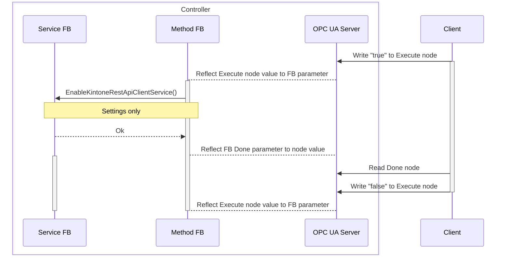
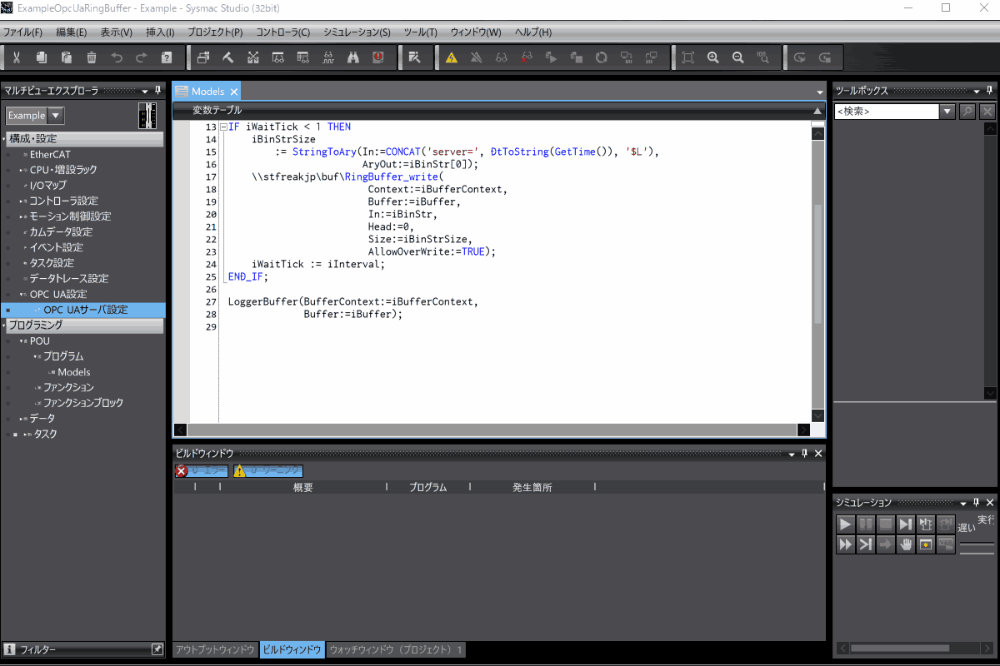

# KintoneRestApiClientServiceController
**KintoneRestApiClientServiceController**は、OPC UAで公開した制御ノードを操作するクライアントです。
[PwshOpcUaClient](https://github.com/kmu2030/PwshOpcUaClient)を使用します。
**KintoneRestApiClientServiceController**は、制御ノードが[PseudoUAMethodExample](https://github.com/kmu2030/PseudoUAMethodExample)で示す疑似UA Methodとして公開するノードを使用してAPIクライアントサービスを操作します。

制御ノードによる操作は、クライアント/サーバの双方について広範な内容を含みます。
また、スタック固有の内容とOPC UA一般の内容が混在することで、複雑さも増します。
そのため、ここで示す情報には不足があります。
コントローラのOPC UAサーバ機能については、メーカーのマニュアルをよく確認してください。
OPC UAクライアントについては、使い慣れたOPC UAスタックがあれば、KinoneRestApiClientServiceControllerを参考にそのスタックを使用してください。

## 使用環境
OPC UAによる制御ノード公開には、以下が必要です。

| Item          | Requirement |
| :------------ | :---------- |
| Controller    | NX1(Ver.1.64以降), NX5(Ver.1.64以降), NX7(Ver.1.35以降), NJ5(Ver.1.63以降) |
| Sysmac Studio | Ver.1.62以降 |

クライアントの使用には、以下が必要です。

| Item          | Requirement |
| :------------ | :---------- |
| PowerShell    | 7.5以降 |

## 構築環境
KintoneRestApiClientServiceControllerは、以下の環境で構築しています。

| Item            | Version              |
| :-------------- | :------------------- |
| Controller      | NX102-9000 Ver.1.64 HW Rev.A |
| Sysmac Studio   | Ver.1.63 |
| PowerShell      | 7.5.2 |
| Pester          | 5.7.1 |

## クライアントの構成
クライアントは、以下で構成します。

* **KintoneRestApiClientServiceController.ps1**   
  クライアント本体です。

* **KintoneRestApiClientServiceController.Tests.ps1**   
  **Pester**と`../KintoneRestApiClientServiceLib.smc2`を使用したクライアントのテストです。   

* **ModelTestController.ps1**   
  `../KintoneRestApiClientServiceLib.smc2`のテストPOU(`POU/プログラム/ModelTest`)を操作します。

* **PwshOpcUaClient/**   
   PwshOpcUaClientです。
   使用方法は、[PwshOpcUaClient](https://github.com/kmu2030/PwshOpcUaClient)を参照します。

## クライアントの使用手順
クライアントの使用手順の概略は、以下です。

1. **PwshOpcUaClientのセットアップ**

2. **PwshOpcUaClientとクライアントをPowerShellセッションにロード**

3. **クライアントを使用するコードの実行**

クライアントを使用するコードの例示として、APIクライアントサービスを開始/停止する操作スクリプトがあります。

## 操作スクリプト
操作スクリプトは、クライアント使用の例示です。
操作スクリプトは、以下です。

* **StartService.ps1**   
  APIクライアントサービスを開始します。

* **StartServiceWithSettings.ps1**   
  指定した設定でAPIクライアントサービスを開始します。

* **StopService.ps1**   
  APIクライアントサービスを停止します。  

以下は、操作スクリプトのためのユーティリティです。

* **Import-Env.ps1**   
  `.env`ファイルをセッションに読み込む関数を定義します。   
  操作スクリプトの共通パラメータを`.env`で定義し、セッションに読み込むために使用します。

### 操作スクリプトのシーケンス
`StartService.ps1`を対象に操作スクリプトのシーケンスを確認します。操作によって、読み書きするノードとその数は異なりますが、シーケンスは同様です。
制御ノードが公開する操作は、何れもAPIクライアントサービス操作POUの実行を内部にもつFBにマップします。
操作スクリプトは、制御ノードが公開するFBのExecuteパラメータを読み書きすることでそのFBを実行し、APIクライアントサービスへの操作を実行します。

以下がシーケンス図です。

*  **Service FB**   
   コントローラで動作するKintoneRestApiClientServiceSingleton FBです。
*  **Method FB**    
   OPC UAで公開した制御ノードのメンバーであるKintoneRestApiClientServiceModel_start FBです。
* **Client**   
   `StartService.ps1`です。



## 操作スクリプトの使用手順
サンプルプロジェクト(`../KintoneRestApiClientServiceLibExample.smc2`)での使用手順を確認します。
サンプルプロジェクトは、デフォルトで制御ノードを公開するよう構成しています。
コントローラのOPC UAサーバへユーザーとクライアント証明書を登録することで、操作スクリプトは正常に機能します。
全ての操作スクリプトが機能するよう、ユーザーは、`管理者`として登録します。

### 共通事項
操作スクリプトは、コントローラのOPC UAサーバとPwshOpcUaClientのOPC UAクライアントを使用します。
そのため、サーバとのセッション確立時や、メッセージ交換に署名または、署名と暗号化を使用するとサーバ、クライアントそれぞれが証明書を拒否する可能性があります。
いずれも拒否した証明書を信頼することで、次回の接続から拒否しなくなります。
証明書に問題が無ければ、以下の操作を行います。

* **PwshOpcUaClientがサーバ証明書を拒否したとき**  
   サーバ証明書が意図したものであれば、`PwshOpcUaClient/pki/rejected/certs`に格納されたサーバ証明書を`PwshOpcUaClient/pki/trusted/certs`に移動します。
* **サーバがクライアント証明書を拒否したとき**   
   コントローラのOPC UAサーバで拒否した証明書を信頼します。

操作スクリプトで共通に使用するパラメータは、以下の`.env`ファイルを作成し、PowerShellセッションにロードしておくと操作の負担が減ります。

```bash
# OPC UAサーバのアドレス
OPC_UA_ENDPOINT=opc.tcp://192.168.250.1:4840
# アクセスするユーザー
OPC_UA_CLIENT_USER=taker
# アクセスするユーザーのパスワード
OPC_UA_CLIENT_PASSWORD=chocolatepancakes
# 制御ノードのノードID
KINTONE_REST_API_CLIENT_SERVICE_NODE=ns=4;Services/KintoneRestApiClientService
# APIクライアントサービス設定ファイルのパス
KINTONE_REST_API_CLIENT_SERVICE_SETTINGS_URL=./kintone.settings.json
```

APIクライアントサービス設定は、以下の構造のJSONを受け付けます。

```json
{
    "Applications": [
        {
            "Name": "TroubleCollection",
            "Subdomain": "YOUR_SUBDOMAIN",
            "AppId": "YOUR_APP_ID",
            "ApiToken": "YOUR_API_TOKEN",
            "TlsSessionName": ""
        },
        {
            "Name": "ProductionMonitor",
            "Subdomain": "YOUR_SUBDOMAIN",
            "AppId": "YOUR_APP_ID",
            "ApiToken": "YOUR_API_TOKEN",
            "TlsSessionName": ""
        },
        {
            "Name": "ProductionTask",
            "Subdomain": "YOUR_SUBDOMAIN",
            "AppId": "YOUR_APP_ID",
            "ApiToken": "YOUR_API_TOKEN",
            "TlsSessionName": ""
        }
    ],
    "TlsSessionNames": [
        "TLSSession0",
        "TLSSession1"
    ]
}
```

### コントローラのOPC UAサーバでの使用手順
`StartServiceWithSettings.ps1`の手順を示します。
手順は以下です。

1. **PwshOpcUaClientのセットアップ**   
   セットアップ済みの場合、不要です。
   以下をPowerShellで実行します。

   ```powershell
   ./PwshOpcUaClient/setup.ps1
   ```

2. **Sysmac StuidoでSysmacプロジェクト(KintoneRestApiClientServiceLibExample.smc2)を開き構成を使用環境に合わせる**

3. **Sysmacプロジェクトをコントローラに転送**

4. **コントローラのOPC UAサーバの設定**   
   コントローラのOPC UAサーバに以下のユーザーを登録し、セキュリティ設定を変更します。

   | ユーザー | パスワード | ロール |
   |-|-|-|
   |taker|chocolatepancakes| 管理者 |

   Sysmac Studioでコントローラに接続し、以下のように操作してOPC UAサーバを設定します。

   

   セキュリティ設定を行ったら、PwshOpcUaClientのクライアント証明書を信頼するために一度操作スクリプトを実行して拒否させた後、信頼リストに移動します。

5. **.envと設定ファイルの作成**   
   共通事項に挙げた`.env`と設定ファイルを使用環境に合わせて作成します。

6. **操作スクリプトの実行**   
   `.env`をセッションにロードし、有効な設定ファイルがある状態で以下を実行します。

   ```powershell
   ./StarServiceWithSettings.ps1
   ```

   `true`が返ってくれば、操作は成功です。設定ファイルの内容に問題が無く、kintoneアプリケーションに接続できていれば間もなくレコードが作成されます。

## ライセンスについて
**PwshOpcUaClient**を使用するコードは、GPLv2ライセンスです。
その他は、MITライセンスです。
